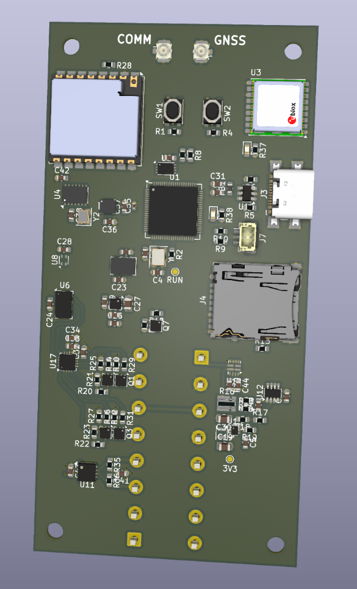
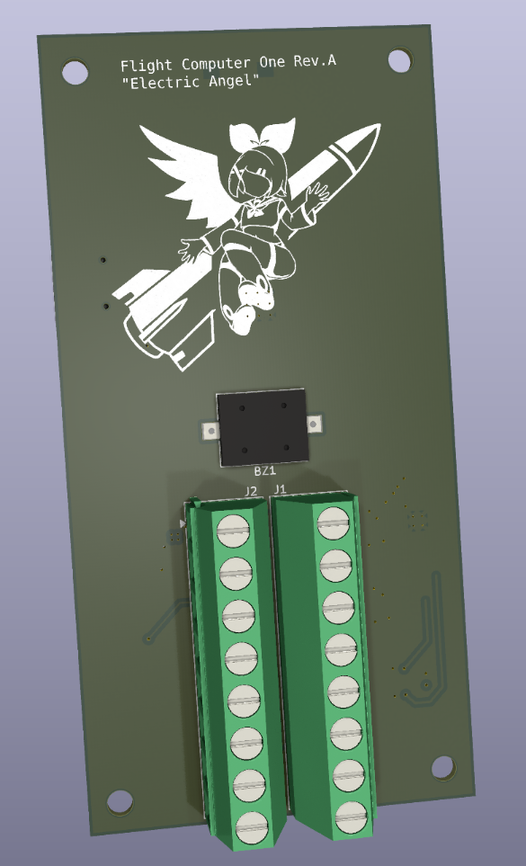

# Flight Computer One "Electric Angel"
KiCad PCB repository for Electric Angel, LRI's first fully featured flight computer. An evolution of the Flight Computer Lite (nicknamed Digital Tripper), it integrates several great new features, like a packet radio, CAN FD, hardware floating-point acceleration, pyro channels, servo controls and more! Electric Angel can do many things: it can fly model rockets with active controls, act as a wireless comms link for liquid powertrain operation, or maybe someday, both at the same time. It can also log data at a rate exceeding that of Digital Tripper.

Electric Angel integrates the Atmel SAME51 microcontroller. This chip is widely used and has great Arduino support, so most control and comms code written for Digital Tripper should be directly portable. Obviously the board layouts are not identical, so relevant changes for interfacing with the other chips will need to be made to any code that was written for DT.

Electric Angel is a 50mm x 100mm rectangle and is designed to fit longitudinally in an avionics bay. Its physical design is inspired by the TeleMega series of altimeters.

  
  

Ingredients:
* The "brain", an Atmel SAME15J19A
* Various digital sensors
    * TDK InvenSense ICM-42688-P high-accuracy 6DoF IMU
    * Bosch BMI088 6DoF IMU for backup and a higher (24 g) acceleration limit
    * STmicroelectronics LIS2MDL 3-axis magnetometer
    * TE Connectivity MS5611 barometer/altimeter
    * Sensirion SHT40 for ambient temperature and humidity
    * u-blox MAX-M10S GNSS receiver and a u.FL antenna connector
* A 915MHz LoRa radio module and a u.FL antenna connector (Ai-Thinker RA-01H)
* An automotive-rated 3.3V CAN FD transceiver (Texas Instruments TCAN3404-Q1)
* A push-push microSD card slot for vibration-resistant datalogging
* A piezo buzzer for auditory feedback
* A USB Type-C 2.0 port for programming and serial communication
* A power monitor IC
* A power mux for utilizing battery (2S or 3S lithium packs supported) or USB power
* A 3.3V-output buck converter
